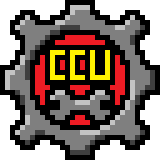



<h1 align="center">
 
Mutators
</h1>
  

An Asterisk (*) Next to a name indicates a Player feature. This means it will be accessible by players, and won't have the [CCU] name prefix that Designer-only content has. It also costs Nuggets to unlock, because CCU is a scam to get your precious nuggets. 

##			Followers
|Mutator											|Effect													|
|:--------------------------------------------------|:------------------------------------------------------|
|Homesickness Disabled[^1]							|- Followers no longer leave the party at the end of the level - Homesickness Killer removed from trait choice pool
|Homesickness Mandatory[^1]							|- Followers *always* leave at the end of the level - Homesickness Killer removed from trait choice pool

[^1]: This is a Player feature. This means it will be accessible by players, and won't have all the [CCU] name prefixes that Designer-only content has. It also costs Nuggets to unlock, because CCU is a scam to get your precious nuggets. Sucker!