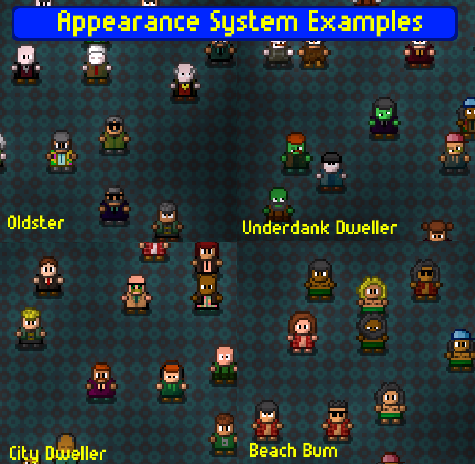



<h1 align="center">
 
Appearance System
</h1>
  

There are a *lot* of traits in this category, but the system is very simple. 

Most traits refer to a single value in the character creator, e.g. "Blue Legs," "Mohawk," etc. Some of them refer to groups, e.g. "Punk Hairstyles," or "Human Skin Tones." They are all compatible, so you could use the overlap between "Mohawk" and "Punk Hairstyles" if you want to slightly weight the pool towards that particular style. Others have special effects, like Pantsless, which matches Leg color to Skin color. 

All added appearance traits are thrown into pools for each type. When the NPC is generated, a random selection is pulled from each pool for its appearance. If a pool is empty, the default appearance from the character creator is used for that element. The end result is that NPC classes will have variable appearances.

Note that the default appearance in the character creator's appearance page does *not* add values to appearance pools. 

#				Best Practices
Below are just my baseline insights from playing around with the system while developing it. If you have any tips you want to add here, get in touch with me.

####				Test En Masse
With so many random variables, it's hard to tell whether the look is perfect unless you see a ton of examples. Use a chunk with lots of copies of the same NPC to identify weird edge cases and gradually sculpt an aesthetic. 

One bonus is that if you decide to share this character on the workshop, you can use that picture to give a more accurate idea of what the character will tend to look like.

####				Creative Weighting
Use the grouped traits and redundancy to your advantage. Here's an example trait list:
> Black Hair, Brown Hair, Blonde Hair, Normal Hair Colors, Normal Hair Colors (No Grey), Wild Hair Colors

This combination has three copies of the most common hair colors (two copies each are applied by *Normal Hair Colors* and *Normal Hair Colors (No Grey)*. Orange hair is demographically rare so it's not added a third time. Wild Hair Colors are only added once, to make dyed hair somewhat rare. 

####				Less is More... More or Less
It's tempting to throw a ton of traits into the list. But keep in mind part of what makes Streets of Rogue brilliant: That appearances *don't* vary that much in vanilla, because making everything immediately visually identifiable was one of the designer's priorities. And that's what made its fast-paced gameplay work so naturally. In fact, I might go so far as to say that *most* of your NPCs should probably only vary in hair and skin colors, like vanilla ones.

This is not to say that highly visually-variable agents aren't useful. It can be good if you want to surprise the player, present visual variety through a human backdrop of nobodies, or give a faction's footsoldiers a bit of texture. But if you go too crazy with it, the player will never know who they're interacting with without checking their name manually. And your characters will all kind of dissolve into an amorphous mass of... everything all at once.

As with all things, go crazy in moderation!

#	Traits
Some of these lists are skipped, when the contents are really obvious. The alphanumeric codes before the category names are just to keep everything in a coherent order, since alphabetical sorting is default.

##			AC1: Accessory
Hats, sunglasses, and other Earth human cranial adornments.

##			AC3: Accessory Special

|Trait								|Effects								|
|:----------------------------------|:--------------------------------------|
|No Accessory 50%					|50% chance to spawn with no accessory, regardless of items in the pool
|No Accessory 75%					|75% chance to spawn with no accessory, regardless of items in the pool

##			BC1: Body Color
Body Color. The color of the body. The color that the body is. Kuzco's body's color.

##			BC3: Body Color Special

|Trait								|Effects								|
|:----------------------------------|:--------------------------------------|
|Neutral Body 50%					|50% chance to not apply a body color
|Neutral Body 75%					|75% chance to not apply a body color
|Shirtless							|Body color matches skin color
|Shirtsome							|Body color is rerolled if it matches skin color

##			BT1: Body Type
Costume

##			BT2: Body Type Greyscale
*Costume Classic ©*

##			ET1: Eye Type
You can pick your eyes, but not your nose. Thanks a lot, Matt.

##			EC3: Eye Color Special

|Trait								|Effects								|
|:----------------------------------|:--------------------------------------|
|Beady-Eyed							|Eye color matches skin color. Canadian syndrome.

##			FH1: Facial Hair
Having a beard and a Yeti cooler doesn't make you a mountain man. I'm talking to you, Texas.

##			FH3: Facial Hair Special

|Trait								|Effects								|
|:----------------------------------|:--------------------------------------|
|No Facial Hair 50%					|50% chance to spawn with no facial hair, regardless of items in the pool
|No Facial Hair 75%					|75% chance to spawn with no facial hair, regardless of items in the pool

##			HC1: Hair Color
The color of -- hey, you get it! Wow, you're really, really, really, really smart!

##			HC2: Hair Color Grouped

|Hair Color			|Normal	|Normal (No Grey)	|Wild	|
|:------------------|:-----:|:-----------------:|:-----:|
|Black				|✓		|✓					|		|
|Blonde				|✓		|✓					|		|
|Blue				|		|					|✓		|
|Brown				|✓		|✓					|		|
|Green				|		|					|✓		|
|Grey				|✓		|					|		|
|Orange				|✓		|✓					|		|
|Pink				|		|					|✓		|
|Purple				|		|					|✓		|
|Red				|		|					|✓		|
|White				|		|					|		|

##			HC3: Hair Color Special

***Mask:** Any non-hairstyle, like the Hoodie, Gorilla Head, etc.*

|Trait								|Effects								|
|:----------------------------------|:--------------------------------------|
|Matched Masks						|If a mask is rolled, matches its color to Body Color
|Uncolored Masks						|If a mask is rolled, it won't be colored

##			HS1: Hairstyle
You're really gonna hate the names in this group, because they don't sound like what they look like. But I copied vanilla, and that's my excuse!

##			HS2: Hairstyle Grouped

|Hairstyle			|Balding|Bangs	|Female	|Long	|Male	|Not Hairstyles	|Punk	|Short Female	|Short	|Stylish|
|:------------------|:-----:|:-----:|:-----:|:-----:|:-----:|:-------------:|:-----:|:-------------:|:-----:|:-----:|
|Afro				|		|		|		|		|✓		|				|		|				|		|		|
|Alien Head			|		|		|		|		|		|✓				|		|				|		|		|
|Assassin Mask		|		|		|		|		|		|✓				|		|				|		|		|
|Bald				|✓		|		|		|		|✓		|				|✓		|				|		|		|
|Balding			|✓		|		|		|		|✓		|				|		|				|		|		|
|Bangs Long			|		|✓		|✓		|✓		|		|				|✓		|				|		|		|
|Bangs Medium		|		|✓		|✓		|✓		|		|				|✓		|				|		|		|
|Butler Bot Head	|		|		|		|		|		|✓				|		|				|		|		|
|Cop Bot Head		|		|		|		|		|		|✓				|		|				|		|		|
|Curtains			|		|		|		|		|✓		|				|		|				|		|		|
|Cutoff				|		|		|✓		|		|		|				|		|				|		|		|
|Flat Long			|		|		|✓		|✓		|		|				|		|				|		|		|
|Gorilla Head		|		|		|		|		|		|✓				|		|				|		|		|
|Hobo Beard			|		|		|		|		|		|				|		|				|		|		|
|Hoodie				|		|		|		|		|		|✓				|		|				|		|		|
|Killer Robot Head	|		|		|		|		|		|✓				|		|				|		|		|
|Leia				|		|		|✓		|		|		|				|✓		|✓				|		|		|
|Messy Long			|		|		|✓		|✓		|		|				|		|				|		|		|
|Military			|		|		|		|		|✓		|				|		|				|✓		|		|
|Mohawk				|		|		|		|		|✓		|				|✓		|				|		|		|
|Normal Hair		|		|		|		|		|✓		|				|		|				|✓		|		|
|Normal High		|		|		|		|		|✓		|				|		|				|✓		|		|
|Pompadour			|		|		|		|		|✓		|				|		|				|		|✓		|
|Ponytail			|		|		|✓		|		|		|				|		|✓				|		|		|
|Puffy Long			|		|		|✓		|✓		|		|				|		|				|		|		|
|Puffy Short		|		|		|		|		|✓		|				|		|				|		|		|
|Robot Head			|		|		|		|		|		|✓				|		|				|		|		|
|Sidewinder			|✓		|✓		|		|		|✓		|				|		|				|		|		|
|Slavemaster Mask	|		|		|		|		|		|✓				|		|				|		|		|
|Spiky				|		|		|		|		|✓		|				|✓		|				|✓		|✓		|
|Spiky Short		|		|		|		|		|✓		|				|✓		|				|✓		|✓		|
|Suave				|		|		|		|		|✓		|				|		|				|		|✓		|
|Wave				|		|		|✓		|✓		|		|				|		|				|		|		|
|Werewolf Head		|		|		|		|		|		|✓				|		|				|		|		|

##			HS3: Hairstyle Special

|Trait								|Effects								|
|:----------------------------------|:--------------------------------------|
|Masks 50%							|If the hairstyle pool contains any Masks, raises their likelihood of being drawn to 50%.

##			LC1: Legs Color
These rectangles do a lot of work. Legs, pants, shoes, all depending on context. Give it up for the rectangles, folks! 👏👏👏

##			LC3: Legs Color Special

|Trait								|Effects								|
|:----------------------------------|:--------------------------------------|
|Pantiful							|Legs color is rerolled if it matches skin color
|Pantsless							|Legs color matches skin color

##			SC1: Skin Color
All skin color options

##			SC2: Skin Color Grouped

|Skin Color			|Human	|Shapeshifter	|Vampire|Zombie	|
|:------------------|:-----:|:-------------:|:-----:|:-----:|
|Black				|		|				|		|		|
|Blue				|		|				|		|		|
|Brown				|		|				|		|		|
|Gorilla			|		|				|		|		|
|Green				|		|				|		|		|
|Grey				|		|				|		|		|
|Human Black		|✓		|				|✓		|		|
|Human Gold			|✓		|				|		|		|
|Human Light Black	|✓		|				|		|		|
|Human Mixed		|✓		|✓				|		|		|
|Human Pale			|✓		|✓				|		|		|
|Human Pink			|✓		|✓				|		|		|
|Human Super Pale	| 		|				|✓		|		|
|Human White		|✓✓		|✓✓				|		|		|
|Mech				|		|				|		|		|
|Orange				|		|				|		|		|
|Pink				|		|				|		|		|
|Purple				|		|				|		|		|
|Red				|		|				|		|		|
|Werewolf			|		|				|		|		|
|White				|		|				|		|		|
|Yellow				|		|				|		|		|
|Zombie 1			|		|				|		|✓		|
|Zombie 2			|		|				|		|✓		|