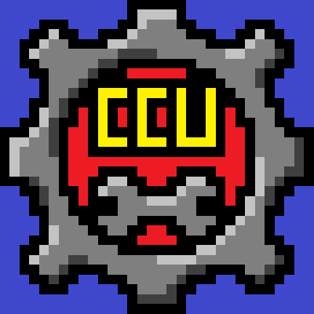
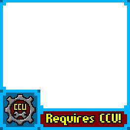



<h1 align="center">
 
Best Practices
</h1>
  

##			Content Management

###				Character Templates
There are a ton of Designer traits. If you use certain sets of them a lot, consider saving a "Template character" to be loaded and renamed. It can save you a lot of time navigating through the trait menu.

##			Steam Uploads
You can upload Custom Characters, Chunk Packs, and Campaigns with CCU content. Players need at least one version of CCU installed for your content to work correctly. 

###				Naming
If you make content with CCU, you are <u>strongly advised</u> to put [Mod], [CCU] or something similar in your steam upload title to catch their attention. You could also put a warning in the upload's image. If they don't have CCU and try to play your content, it will play as a (really confusing) vanilla campaign.

###				Description
In the upload's description, provide a link to the Player Edition and advise them to install it for the full experience.

###				Thumbnail
If you want, you can add a layer to your image thumbnail. This will increase attention to your content and reduce the likelihood of players playing it incorrectly. Below are some images I've made, and you're free to use/edit them as you see fit.

|16x16  |64x64  |160x160  |400x400  |Character Frame  |
|:-----:|:-----:|:-------:|:-------:|:---------------:|
|||||

##			Suggestions?
Best Practices are generally discovered by the people using a tool, not the one making it. If you have any ideas for advice or warnings for this page, please get in touch.