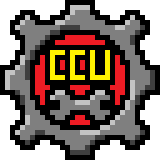

<h1 align="center">
<b>Custom Content Utilities</b>
 
A Streets of Rogue mod</h2>
  

SOR gives you a LOT of options for creating custom content, but with some limitations. Here are a few things that are currently impossible with the Vanilla version:
- Aligning NPCs to factions
- Variable NPC appearances
- Custom NPC behaviors (pickpocketing, hiring, shops, etc.)
- Campaign branching and event triggers

CCU aims to address these limitations, giving more power to content creators, while keeping the player's experience un-cluttered with designer tools.

#		Mod Content
CCU adds the following:
<b>
- [Agent Default Goals](/CCU/Documentation/C01_AgentDefaultGoals.md)
- [Item](/CCU/Documentation/C02_Items.md)
- [Mutators](/CCU/Documentation/C03_Mutators.md)
- [Object Modifications](/CCU/Documentation/C04_Objects.md)
- Traits:
  - [Designer Traits](/CCU/Documentation/C05_DesignerTraits.md)
  - [Player Traits](/CCU/Documentation/C0503_PlayerTraits.md)
</b>

#   Others

- [Installation](/CCU/Documentation/M01_Installation.md)
- [Best Practices for Designers](/CCU/Documentation/M02_BestPractices.md)
- [Change Log](/CCU/Documentation/M03_ChangeLog.md)

#		Links
- [CCU Showcase](https://steamcommunity.com/sharedfiles/filedetails/?id=2852074522) - A Steam collection of Chunk Packs and Campaigns with CCU content
- [Development Discord Thread](https://discord.com/channels/187414758536773632/991046848536006678) - For development updates, feature requests, questions, bug reports

#		Special Thanks
I was keeping this list pretty detailed, but it's getting too long. You all rule, thanks.

- **Abbysssal**
- **AMeanPineapple**
- **BlazingTwist**
- **BOTOutlaw**
- **Cheese Wizard**
- **ChillyConMor**
- **Cyan_Light**
- **GenEric**		
- **Guoxin_**
- **uwumacaronitime**
- **TBB[z]**
- **TheShadowHat**

##			Content Attributions

|Homie(s)								|Thanks	|
|--------------------------------------:|:------|
|**GenEric**|Spanish translation
|**Romeo Kaleikau** (FreeSound.org)|Class-A-Ware sound effect

##			The future of CCU
Version 1.4.0 will likely be the last version of CCU. This is for a few reasons.
- Streets of Rogue 2 is slated to come out this year, and will use much of the content of the first game, so there's a very good chance that SOR1 will become obsolete in many respects. If the second installment absolutely sucks I might consider continuing with this project.
- This was one of my first programming projects. I've never really made anything else that I got working that wasn't from a tutorial or dead-simple. Often, the way I went about things was severely limited by my technical knowledge. So there's a lot of bad code and bad organization here that even major refactors haven't been able to root out. I'm looking forward to a fresh start someday if this is continued in SOR 2.
- The playerbase for the game is already small, and the mod's audience is further narrowed to PC users who are willing to use mods and use the tedious game editors to make content. This audience will likely shrink further when the second game comes out. I love the SOR community, but it's not very motivating to do weeks of work and only hear from one or two people that actually use it. While there are a few Designers making a ton of really quality content, even their work is tragically under-exposed due to a small audience.
- I have other mods to publish. Like, a ton of content is already complete. I just need to finish it up. Keep an eye out for this laughably optimistic timeline: 
  - Resistance HR: Player Traits - Summer 2024?
  - Resistance IT (Formerly SORCE): Mutators - Autumn 2024?
  - Resistance R&D: Items - lol never
